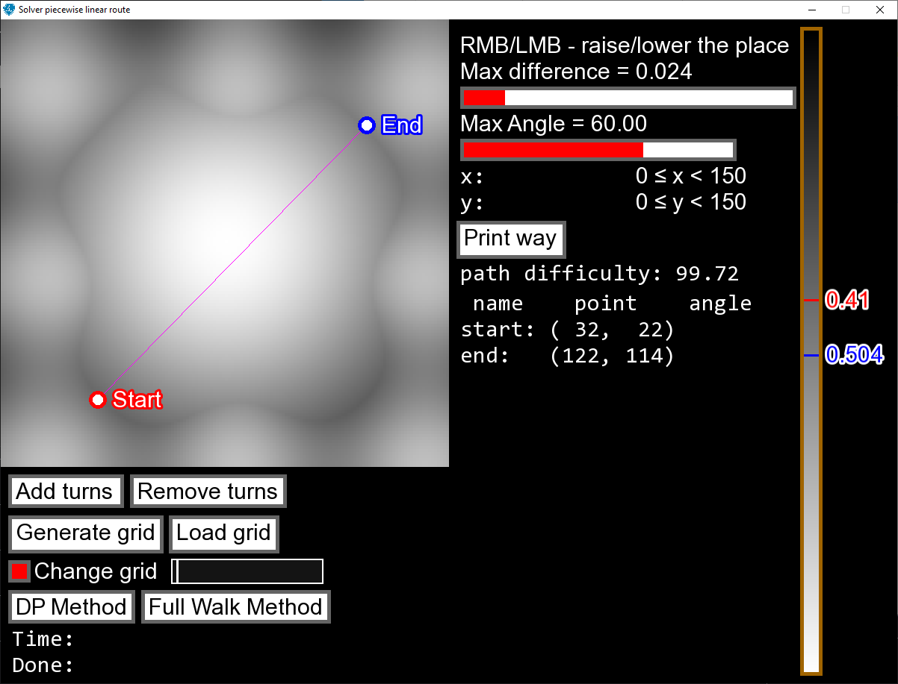

# Solver piecewise-linear route
Программа оптимизации кусочно-прямолинейных маршрутов с графическим интерфейсом на SFML.

## Запуск (Windows)
1. Скачайте папку `app`.
2. Запустите `app.exe`.

## Использование (все платформы)
1. Загрузить карту местности с помощью ввода полного названия изображения в окно ввода и нажатием кнопки `Load grid` (окно ввода расположено непосредственно под кнопкой).
2. Перетащить курсором мыши начальную и конечную точки маршрута на карту, отобразившейся в левом верхнем углу.
3. Добавить необходимое количество точек поворота кнопками `Add turn` и `Remove turn`.
4. С помощью горизонтального слайдера под `Max Angle` выставить значение максимального угла поворота.
5. Выбрать метод, которым будет решена задача с помощью кнопок `DP Method` и `Full Walk Method`.

## Алгоритм "DP Method"
Алгоритм основан на использовании парадигмы динамического программирования. То есть, оптимальный маршрут, содержащий n углов поворота, содержит в себе оптимальный маршрут с (n-1) углами поворотами.

## Алгоритм Full Walk Method
Алгоритм основан на алгоритме полного перебора допустимых маршрутов с n углами поворота. Быстродействие алгоритма достигается благодаря использованию точной формулы, описывающей множество допустимых ломаных при ограничении на угол поворота.

## Лицензия
[GNU AGPL v3](LICENSE)
